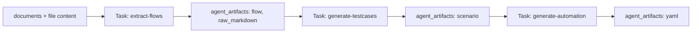

# Agent Pipeline Data Flow & Artifact Storage

Tài liệu này mô tả flow kỹ thuật của dữ liệu vào/ra qua 3 agent và cơ chế lưu trữ output bằng bảng `agent_artifacts`.

## Tổng Quan

Pipeline có 3 stage:

1. Agent 1: đọc nội dung document và chuẩn hóa thành UX flows.
2. Agent 2: đọc flows của Agent 1 và sinh QA test scenarios.
3. Agent 3: đọc scenarios của Agent 2 và sinh AutoMobile YAML scripts.

Mỗi lần chạy agent tạo một record trong `tasks`. Output chi tiết của agent được lưu item-level trong `agent_artifacts`. Bảng `testcases` chỉ còn là legacy/deprecated; runtime không dùng nó làm source of truth nữa.



## Storage Model

### `tasks`

`tasks` quản lý lifecycle của một run:

- `type`: `extract-flows`, `generate-testcases`, `generate-automation`
- `status`: `pending`, `processing`, `completed`, `failed`
- `project_id`: project sở hữu run
- `source_run_id`: task upstream mà run hiện tại dựa vào
- `input_content_hash`: hash của input upstream tại thời điểm tạo task
- `output_content_hash`: hash của artifact output sau khi hoàn tất
- `version_status`: `draft` hoặc `committed`
- `result`: chỉ giữ summary/metadata nhẹ, không giữ output chi tiết

Ví dụ `tasks.result` sau refactor:

```json
{
  "flowCount": 12,
  "featureCount": 4,
  "feedback_prompt": "..."
}
```

```json
{
  "scenarioCount": 36,
  "feature_name": "Extracted Feature",
  "markdownLength": 12000
}
```

```json
{
  "yamlCount": 36,
  "summary": "Generated 36 automation scripts.",
  "framework": "Mobile Auto Platform"
}
```

### `agent_artifacts`

`agent_artifacts` là source of truth cho output chi tiết:

- `task_id`: task tạo artifact
- `project_id`: project sở hữu artifact
- `agent_type`: `agent1`, `agent2`, `agent3`
- `artifact_type`: `flow`, `raw_markdown`, `scenario`, `yaml`
- `artifact_key`: key ổn định trong phạm vi task + type
- `title`: tên hiển thị
- `content_json`: payload có cấu trúc
- `content_text`: payload dạng text dài như markdown/YAML
- `ordinal`: thứ tự render/progressive reveal
- `source_artifact_id`: artifact gốc nếu artifact được copy từ partial rerun
- `content_hash`: SHA256 của nội dung artifact

Invariant quan trọng:

- Unique key: `(task_id, artifact_type, artifact_key)`
- UI phải sort theo `ordinal`, sau đó `created_at`.
- Output chi tiết không được ghi mới vào `testcases`.
- `tasks.result` không được chứa lại full `flows`, `scenarios`, hoặc `yaml_files` như source of truth.

## Agent 1: Extract Flows

### Trigger

Endpoint:

```http
POST /api/v1/workflows/extract-flows
```

Request chính:

```json
{
  "project_id": "project-id",
  "document_ids": ["doc-1", "doc-2"],
  "prompt_profile": "optional",
  "feedback_prompt": "optional"
}
```

### Input Build

`WorkflowService.extractFlows` tạo task `extract-flows`.

`_runAgent1Extraction`:

1. Load từng `Document` theo `document_ids`.
2. Gọi `DocumentService.getContent(documentId)`.
3. Concatenate content theo thứ tự người dùng chọn.
4. Gửi sang agents service với context:

```json
{
  "raw_text": "...",
  "prompt_profile": "...",
  "feedback_prompt": "..."
}
```

Input không lưu full `raw_text` vào DB. `input_content_hash` hiện hash theo `{ documentIds, promptProfile }`.

### Output Save

Agent trả completed payload gồm:

```json
{
  "flows": [
    {
      "name": "Login Flow",
      "source": "Auth > Login",
      "steps": ["Open app", "Enter phone"]
    }
  ],
  "raw_markdown": "...",
  "feature_count": 4
}
```

Backend map mỗi flow về frontend shape:

```json
{
  "flowName": "Login Flow",
  "source": "Auth > Login",
  "steps": ["Open app", "Enter phone"]
}
```

Artifacts được ghi:

- `artifact_type = flow`
  - `content_json`: flow object
  - `content_text`: null
  - `artifact_key`: `flow:{ordinal}:{flowName}`
- `artifact_type = raw_markdown`
  - `artifact_key`: `raw_markdown`
  - `content_text`: raw markdown từ agent

`tasks.result` chỉ lưu:

```json
{
  "flowCount": 12,
  "featureCount": 4
}
```

`output_content_hash` tính từ ordered flow objects.

## Agent 2: Generate Test Scenarios

### Trigger

Endpoint:

```http
POST /api/v1/workflows/generate-testcases
```

Request chính:

```json
{
  "task_id": "agent-1-task-id",
  "feedback_prompt": "optional",
  "selected_flow_names": ["Login Flow"],
  "previous_task_id": "optional-agent-2-task-id"
}
```

### Input Build

`WorkflowService.generateTestcases` tạo task `generate-testcases` với:

- `source_run_id`: Agent 1 task id
- `input_content_hash`: Agent 1 `output_content_hash`

`_runAgent2Generation` đọc input từ artifacts của Agent 1:

```js
AgentArtifact.findByTaskIdAndType(sourceTask.id, "flow")
```

Sau đó gửi sang agents service:

```json
{
  "flows": [
    {
      "name": "Login Flow",
      "source": "Auth > Login",
      "steps": ["Open app", "Enter phone"]
    }
  ],
  "feature_name": "Extracted Feature",
  "feedback_prompt": "..."
}
```

Nếu partial rerun, chỉ gửi flows có tên nằm trong `selected_flow_names`.

### Output Save

Agent 2 có thể stream `new_scenarios` trong event `progress`. Backend upsert từng scenario ngay khi nhận được để UI progressive reveal qua SSE.

Artifact được ghi:

- `artifact_type = scenario`
- `artifact_key`: `scenario.id` nếu có, fallback `scenario:{index}`
- `title`: `scenario.name` hoặc flow name
- `content_json`: full scenario object
- `content_text`: null

Khi completed, backend upsert lại toàn bộ `completedData.scenarios` theo unique key. Cơ chế này chống duplicate khi partial-save và final-save cùng chứa một scenario.

Partial rerun:

- Scenario thuộc selected flows được regenerate.
- Scenario không thuộc selected flows được copy từ `previous_task_id`.
- Artifact copy set `source_artifact_id` về artifact cũ.

`tasks.result` chỉ lưu:

```json
{
  "scenarioCount": 36,
  "feature_name": "Extracted Feature",
  "markdownLength": 12000
}
```

`output_content_hash` tính từ ordered scenario artifact content.

## Agent 3: Generate YAML

### Trigger

Endpoint:

```http
POST /api/v1/workflows/generate-automation
```

Request chính:

```json
{
  "task_id": "agent-2-task-id",
  "framework": "Mobile Auto Platform",
  "feedback_prompt": "optional",
  "selected_scenario_ids": ["TC_LOGIN_001"],
  "previous_task_id": "optional-agent-3-task-id"
}
```

### Input Build

`WorkflowService.generateAutomation` tạo task `generate-automation` với:

- `source_run_id`: Agent 2 task id
- `input_content_hash`: Agent 2 `output_content_hash`

`_runAgent3Automation` đọc input từ artifacts của Agent 2:

```js
AgentArtifact.findByTaskIdAndType(sourceTask.id, "scenario")
```

Sau đó gửi sang agents service:

```json
{
  "feature_name": "Extracted Feature",
  "scenarios": [
    {
      "id": "TC_LOGIN_001",
      "name": "Login successfully",
      "steps": []
    }
  ],
  "ui_description": "",
  "framework": "Mobile Auto Platform",
  "feedback_prompt": "..."
}
```

Nếu partial rerun, chỉ gửi scenarios có id nằm trong `selected_scenario_ids`.

### Output Save

Agent 3 trả JSON:

```json
{
  "yaml_files": [
    {
      "filename": "TC_LOGIN_001.yaml",
      "content": "id: TC_LOGIN_001\nname: Login successfully\n..."
    }
  ],
  "summary": "Generated 1 automation script."
}
```

Artifact được ghi:

- `artifact_type = yaml`
- `artifact_key`: filename bỏ `.yaml`
- `title`: filename
- `content_json`: `{ "filename": "...", "framework": "Mobile Auto Platform" }`
- `content_text`: YAML content

Partial rerun:

- YAML thuộc selected scenarios được regenerate.
- YAML không thuộc selected scenarios được copy từ `previous_task_id`.
- Artifact copy set `source_artifact_id` về artifact cũ.

`tasks.result` chỉ lưu:

```json
{
  "yamlCount": 36,
  "summary": "Generated 36 automation scripts.",
  "framework": "Mobile Auto Platform"
}
```

`output_content_hash` tính từ ordered YAML filename + content.

## API Response Compatibility

`GET /api/v1/workflows/tasks/:task_id` trả:

```json
{
  "status": "success",
  "data": {
    "task_id": "...",
    "type": "generate-testcases",
    "status": "completed",
    "result": {},
    "artifacts": [],
    "testcases": []
  }
}
```

`artifacts` là source mới.

`testcases` là compatibility projection được build từ artifacts:

- `scenario` artifact -> `TestcaseItem` có `scenarioData`
- `yaml` artifact -> `TestcaseItem` có `automationYaml` và `yamlFilename`

Frontend mới nên ưu tiên đọc `artifacts`. `testcases` chỉ để giảm rủi ro trong giai đoạn chuyển đổi và giữ các component cũ không gãy ngay.

## SSE Progressive Reveal

Frontend subscribe:

```http
GET /api/v1/workflows/status/:task_id
```

Backend poll task status và flush partial artifacts trong lúc task `processing`.

Event `partial` có shape:

```json
{
  "artifacts": [],
  "testcases": []
}
```

Trong UI:

- Test Scenarios page ưu tiên `scenario` artifacts.
- YAML Export page ưu tiên `yaml` artifacts.
- Nếu không có artifacts, UI fallback sang `testcases`.

## Versioning & Staleness

Stage gate dùng các field trong `tasks`:

- Agent 2 stale nếu `agent2.input_content_hash != activeAgent1.output_content_hash`.
- Agent 3 stale nếu `agent3.input_content_hash != activeAgent2.output_content_hash`.
- Chỉ task `completed` mới commit được.
- `version_status = draft` là kết quả mới nhưng chưa được user xác nhận.
- `version_status = committed` là version active cho downstream.

Quan trọng: hash phải tính từ artifact output đã lưu, không tính từ payload tạm thời khác với DB.

## Developer Notes

Khi thêm hoặc sửa stage pipeline:

1. Tạo `tasks` record trước.
2. Đọc input từ artifacts của upstream, không đọc output chi tiết từ `tasks.result`.
3. Ghi output chi tiết vào `agent_artifacts` bằng upsert theo `(task_id, artifact_type, artifact_key)`.
4. Chỉ sau khi artifacts đã persist thành công mới mark task `completed`.
5. `tasks.result` chỉ lưu count, summary, framework, feedback metadata.
6. Không ghi output mới vào `testcases`.

Các file chính:

- `backend/src/services/WorkflowService.js`: orchestration, input build, artifact save, SSE partial.
- `backend/src/models/AgentArtifact.js`: DB access cho artifacts.
- `backend/migrations/013_create_agent_artifacts.sql`: schema và backfill.
- `frontend/src/lib/artifactHelpers.ts`: map artifacts sang shape UI đang dùng.
